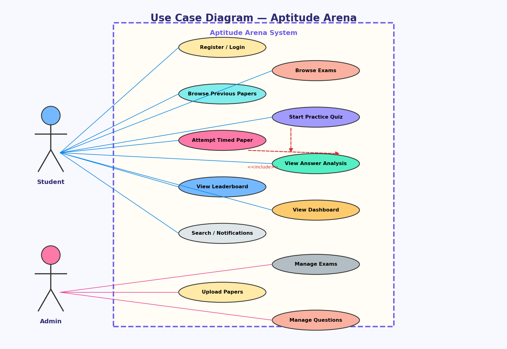
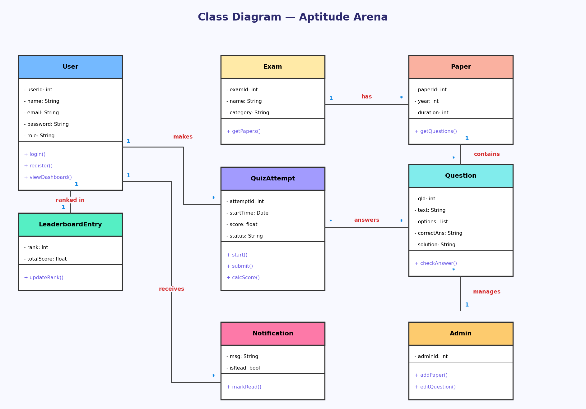
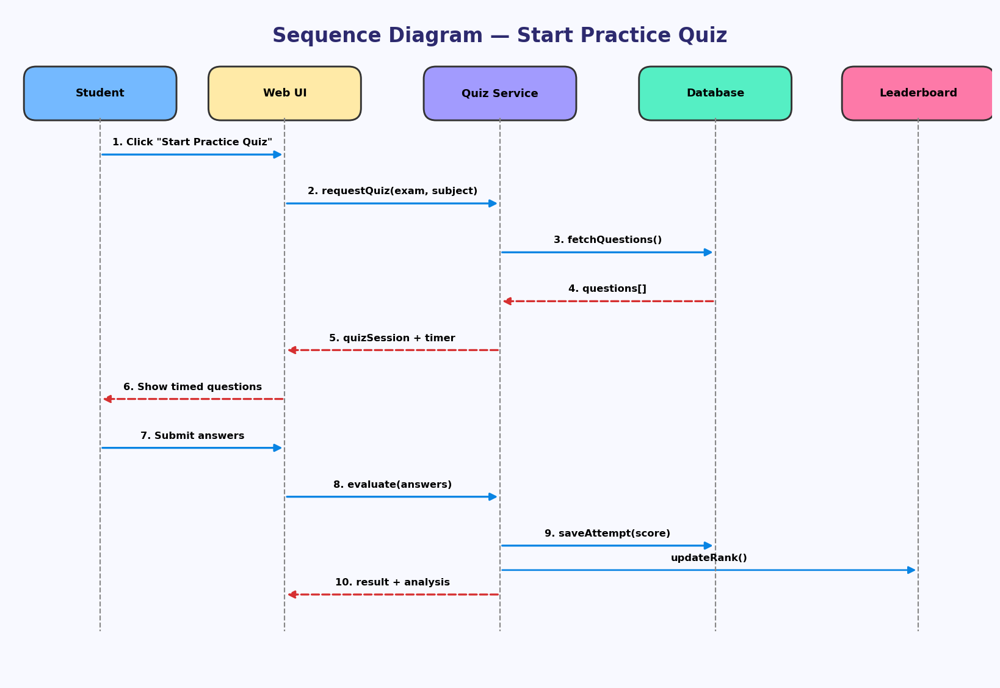
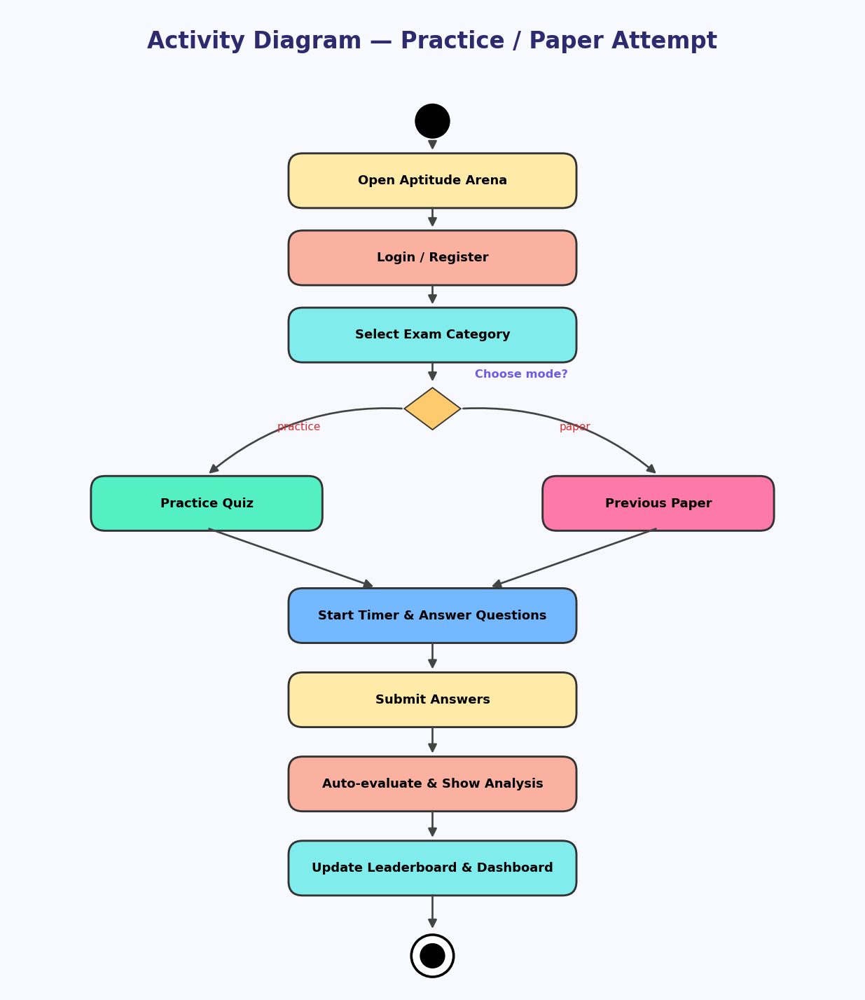
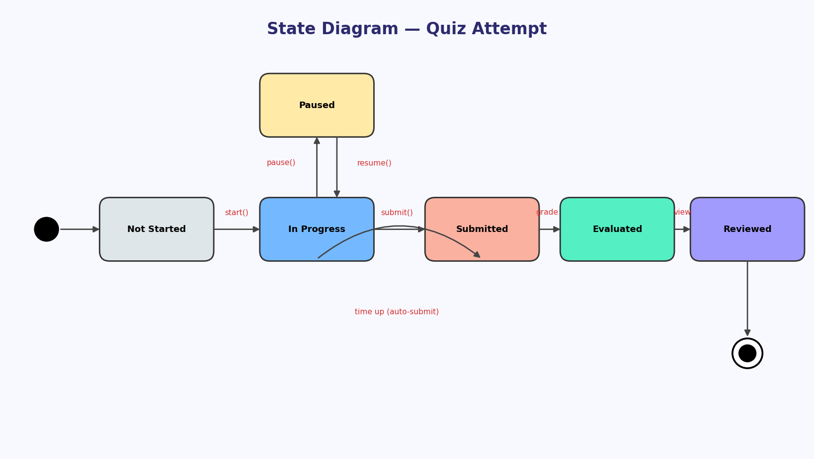
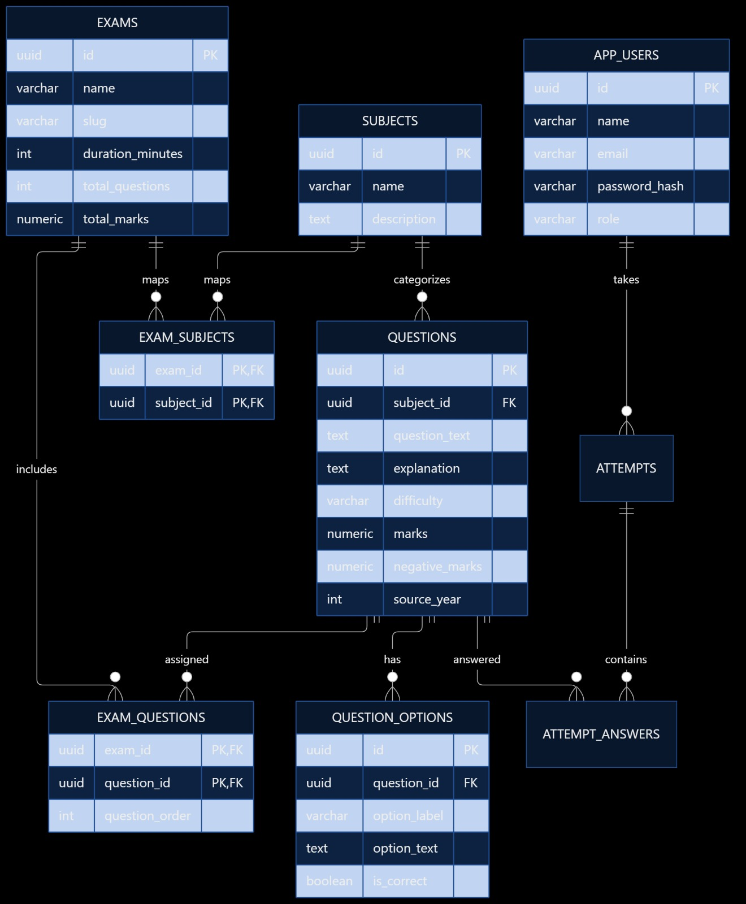
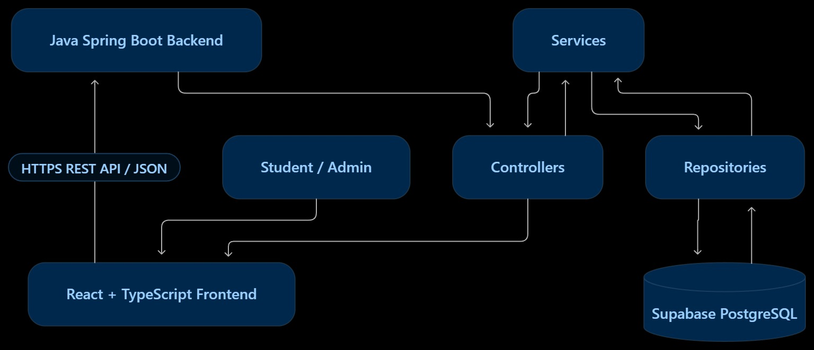
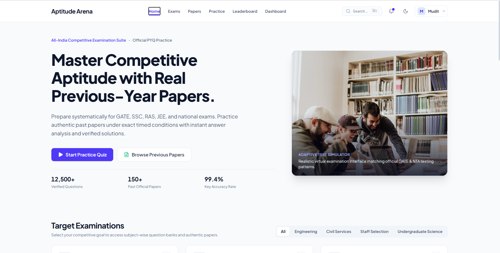
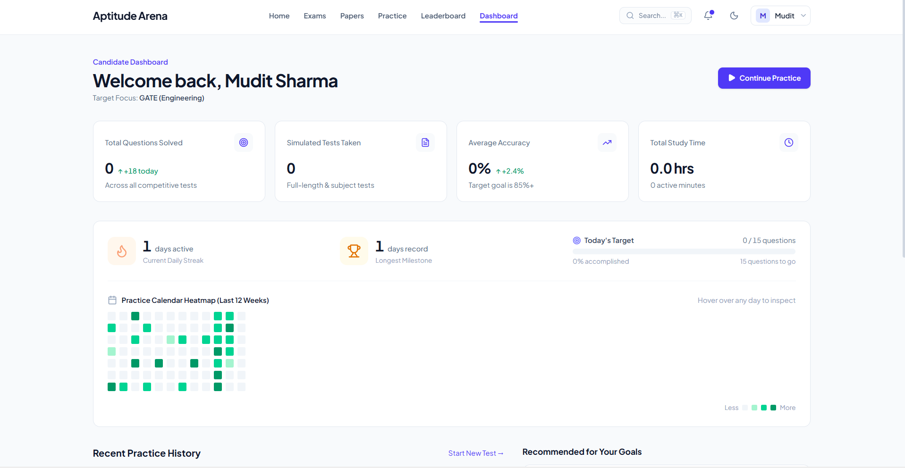

# Aptitude Arena
# week 1

## Project Administration

* **Project Code:** PBL2627-CSE-B-037
* **Project Guide:** Er. Ram Babu Buri
  * **Research Area:** Machine Learning & Data Science
  * **Specializations:** Java, JSP–Servlet, Spring Boot, MySQL, Python

### Team Members

| Name | Roll No. | Enrollment No. | Email | Mobile |
| :--- | :--- | :--- | :--- | :--- |
| Krishna Veer Singh | 24EARCS078 | 24E1ARCSM40P078 | anshumansingh3960@gmail.com | 7300352263 |
| Kushagra Garg | 24EARCS081 | 24E1ARCSM40P081 | kushagrag2024@gmail.com | 8094724706 |
| Kartik | 24EARCS071 | 24E1ARCSM30PO71 | Kartikraria653@gmail.com | 9350802373 |
| Mudit Sharma | 24EARCS096 | 24E1ARCSM40P096 | ms.229.sharma@gmail.com | 9257254580 |
| Piyush Kumar | 24EARCS110 | 24E1ARCSM40P110 | piyish2005jadon@gmail.com | 8000593934 |


## Abstract

Modern e-learning infrastructures designed for high-stakes competitive examination preparation must simultaneously address complex technological, psychometric, and behavioral demands. Aptitude Arena is an advanced, web-based competitive examination practice platform engineered for candidates preparing for national assessments such as GATE, JEE, SSC, and State Public Service Commissions (e.g., RPSC RAS). Traditional online assessment platforms frequently suffer from static evaluation frameworks, network latency during high-concurrency exam events, and low long-term user engagement. Aptitude Arena addresses these challenges by integrating an interactive test simulator, verified Previous Year Question (PYQ) repositories, and continuous behavioral tracking.

The platform's underlying architecture leverages a high-performance Java Spring Boot backend paired with scalable microservices. It adopts a polyglot persistence strategy, utilizing PostgreSQL for ACID-compliant Identity and Access Management (IAM) and structured test metadata, alongside MongoDB for flexible, high-throughput storage of complex question banks and user response logs. To maintain low-latency synchronicity during live test events, the system incorporates WebSocket event-driven communication. Furthermore, an integrated Python microservice leverages Item Response Theory (IRT) algorithms to drive a Computerized Adaptive Testing (CAT) engine, dynamically calibrating question difficulty based on candidate performance.

Ultimately, Aptitude Arena unifies these architectural layers into an interactive Candidate Performance Dashboard. By combining real-time national leaderboards, daily streak tracking, and study activity heatmaps, the system employs behavioral habit-formation loops to maximize candidate consistency. This integration bridges the gap between raw testing and actionable psychometric evaluation, providing a secure, scalable, and adaptive testing ecosystem for competitive exam preparation.


# Week 2

## User Roles & Access Control
Aptitude Arena enforces strict authentication and role management at the API layer utilizing Spring Security and stateless JSON Web Tokens (JWT).
- **Student Candidate:** Can register/login, select from six competitive exam categories (GATE CSE, SSC CGL, RAS Rajasthan, JEE Main, CA Foundation, NEET UG), configure practice tests, submit responses, and view detailed scores and explanations.
- **System Administrator:** Possesses elevated privileges to manage examination catalogues, oversee question banks, monitor system health, and verify deployment metrics across backend APIs.

## SRS Document
You can access the Project SRS [https://1drv.ms/b/c/762dc0e747d4c238/IQCMhlrBCAvIS7UA2KdzgDIJAYt8shqe_3SUruQnmLF1ERM?e=VcytoV)

## Architecture & Core Modules
The Aptitude Arena architecture operates as a distributed full-stack system, with a Spring Boot Java backend acting as the core REST API provider, a React + TypeScript (Vite) interactive frontend client, and a Supabase PostgreSQL persistent database.

### Functional Modules & Team Responsibilities
- **Module 1: User Authentication and Profile Management (Member 1)**
  - **Focus:** Registration, login, identity and access security[cite: 57].
  - **Frontend:** Login page, registration page, authentication forms, login errors, and user profile interface[cite: 57].
  - **Backend:** `AuthController.java`, `AuthService.java`, `AppUserService.java`, JWT generation/validation, and `SecurityConfig.java`[cite: 57].
  - **Database:** `app_users` table, user IDs, email, password hash (BCrypt), and user role[cite: 57].

- **Module 2: Competitive Exam and Subject Management (Member 2)**
  - **Focus:** Exams, subjects, searching, and examination selection across 6 national categories[cite: 58].
  - **Frontend:** Exams page, exam cards, search and filters, and subject selection in practice modes[cite: 58].
  - **Backend:** `ExamController.java`, `ExamService.java`, `SubjectController.java`, and `SubjectService.java`[cite: 58].
  - **Database:** `exams`, `subjects`, and `exam_subjects` tables[cite: 58].

- **Module 3: Question Bank and Practice Engine (Member 3)**
  - **Focus:** MCQs, options, subject filtering, and practice session configuration (handling 600 original practice questions across exams)[cite: 59].
  - **Frontend:** `PracticePage.tsx`, question display, answer options, question count, and difficulty selection[cite: 59].
  - **Backend:** `QuestionController.java`, `QuestionService.java`, `QuestionRepository.java`, and `QuestionOptionRepository.java`[cite: 59].
  - **Database:** `questions`, `question_options`, and `exam_questions` tables[cite: 59].

- **Module 4: Test Attempts, Scoring and Results (Member 4)**
  - **Focus:** Test submission, answer evaluation, and score calculation[cite: 60].
  - **Frontend:** Submit confirmation modal, `QuizResultPage.tsx`, result display, correct/incorrect answers, and detailed explanations[cite: 60].
  - **Backend:** `AttemptController.java`, `AttemptService.java`, `AttemptAnswerService.java`, and attempt/result DTOs[cite: 60].
  - **Database:** `attempts` and `attempt_answers` tables[cite: 60].

- **Module 5: Dashboard, Leaderboard, Papers and Deployment Integration (Member 5)**
  - **Focus:** Connecting modules, cross-module integration, and operating the deployed application[cite: 61].
  - **Frontend:** Shared navigation and layout, `DashboardPage.tsx`, `LeaderboardPage.tsx`, `PapersPage.tsx`, `AdminPage.tsx`, and API integration[cite: 61].
  - **Backend:** Cross-module API integration, CORS configuration, performance verification, and security checks[cite: 61].
  - **Deployment & Hosting:** Google AI Studio (frontend) and Render (backend API)[cite: 41].

## Database Strategy (Supabase PostgreSQL)
The system utilizes Supabase PostgreSQL for robust, ACID-compliant relational data storage:
- **Core Tables:** `exams`, `subjects`, `questions`, `question_options`, `exam_subjects`, `exam_questions`, `app_users`, `attempts`, and `attempt_answers`.
- **Integration:** Connected via Spring Data JPA and Hibernate with secure environment-based configurations.

## Non-Functional Requirements
- **Performance:** Fast response times for question retrieval and test submission endpoints under standard student concurrent loads.
- **Security:** Password hashing via BCrypt, stateless JWT validation, global CORS configuration, and input sanitization.
- **Deployment & Accessibility:** Fully deployed online with live frontend and backend endpoints accessible for evaluation.
## week 3

### Project Diagrams

**1. Use Case Diagram**


**2. Class Diagram**


**3. Sequence Diagram**


**4. Activity Diagram**


**5. State Diagram**


**6. ER Diagram**


# Week 4: Database Design & System Architecture

## 1. Relational Database Schema & ER Design (Supabase PostgreSQL)
The platform utilizes a normalized relational database design to maintain data integrity and minimize redundancy across examination modules.

<div align="center">
  
</div>

<div align="center">
  
</div>

- **`exams` Table:** Stores metadata for national examinations (GATE, JEE, SSC, RAS, etc.) including title, slug, duration, total questions, and maximum marks.
- **`subjects` Table:** Categorizes domain subjects mapped to specific examinations.
- **`exam_subjects` Table:** Junction table managing the many-to-many relationship between exams and subjects.
- **`questions` Table:** Stores core question text, detailed step-by-step explanations, difficulty levels, allotted marks, negative marking rules, and source years.
- **`exam_questions` Table:** Maps specific questions to respective exam papers with custom question ordering.
- **`question_options` Table:** Holds multiple-choice options, option labels, option text, and correct answer flags for each question.
- **`app_users` Table:** Manages user accounts, secure email handles, BCrypt password hashes, and role-based permissions (Student / Admin).
- **`attempts` Table:** Records test session tracking, user IDs, linked exams, final computed scores, start timestamps, and submission timestamps.
- **`attempt_answers` Table:** Tracks individual candidate responses, selected options, and correctness flags per test attempt.

---

## 2. PostgreSQL Database DDL Queries (Supabase Setup)

Aap apne Supabase project ke SQL Editor mein in queries ko run karke complete schema setup kar sakte hain:

```sql
-- 1. EXAMS Table
CREATE TABLE exams (
    id UUID PRIMARY KEY DEFAULT gen_random_uuid(),
    name VARCHAR(255) NOT NULL,
    slug VARCHAR(255) UNIQUE NOT NULL,
    duration_minutes INT NOT NULL,
    total_questions INT NOT NULL,
    total_marks NUMERIC NOT NULL
);

-- 2. SUBJECTS Table
CREATE TABLE subjects (
    id UUID PRIMARY KEY DEFAULT gen_random_uuid(),
    name VARCHAR(255) NOT NULL,
    description TEXT
);

-- 3. EXAM_SUBJECTS Table (Mapping)
CREATE TABLE exam_subjects (
    exam_id UUID REFERENCES exams(id) ON DELETE CASCADE,
    subject_id UUID REFERENCES subjects(id) ON DELETE CASCADE,
    PRIMARY KEY (exam_id, subject_id)
);

-- 4. QUESTIONS Table
CREATE TABLE questions (
    id UUID PRIMARY KEY DEFAULT gen_random_uuid(),
    subject_id UUID REFERENCES subjects(id) ON DELETE CASCADE,
    question_text TEXT NOT NULL,
    explanation TEXT,
    difficulty VARCHAR(50),
    marks NUMERIC NOT NULL,
    negative_marks NUMERIC DEFAULT 0,
    source_year INT
);

-- 5. EXAM_QUESTIONS Table (Mapping)
CREATE TABLE exam_questions (
    exam_id UUID REFERENCES exams(id) ON DELETE CASCADE,
    question_id UUID REFERENCES questions(id) ON DELETE CASCADE,
    question_order INT,
    PRIMARY KEY (exam_id, question_id)
);

-- 6. QUESTION_OPTIONS Table
CREATE TABLE question_options (
    id UUID PRIMARY KEY DEFAULT gen_random_uuid(),
    question_id UUID REFERENCES questions(id) ON DELETE CASCADE,
    option_label VARCHAR(10) NOT NULL,
    option_text TEXT NOT NULL,
    is_correct BOOLEAN DEFAULT FALSE
);

-- 7. APP_USERS Table
CREATE TABLE app_users (
    id UUID PRIMARY KEY DEFAULT gen_random_uuid(),
    name VARCHAR(255) NOT NULL,
    email VARCHAR(255) UNIQUE NOT NULL,
    password_hash VARCHAR(255) NOT NULL,
    role VARCHAR(50) DEFAULT 'STUDENT'
);

-- 8. ATTEMPTS Table
CREATE TABLE attempts (
    id UUID PRIMARY KEY DEFAULT gen_random_uuid(),
    user_id UUID REFERENCES app_users(id) ON DELETE CASCADE,
    exam_id UUID REFERENCES exams(id) ON DELETE CASCADE,
    score NUMERIC,
    started_at TIMESTAMP DEFAULT CURRENT_TIMESTAMP,
    submitted_at TIMESTAMP
);

-- 9. ATTEMPT_ANSWERS Table
CREATE TABLE attempt_answers (
    id UUID PRIMARY KEY DEFAULT gen_random_uuid(),
    attempt_id UUID REFERENCES attempts(id) ON DELETE CASCADE,
    question_id UUID REFERENCES questions(id) ON DELETE CASCADE,
    selected_option_id UUID REFERENCES question_options(id),
    is_correct BOOLEAN
);

## 3. User Interface Previews

Aptitude Arena provides a clean, distraction-free interface designed specifically for competitive examination candidates. Below are previews of the core application modules:

### A. Candidate Dashboard & Activity Heatmap
*Features real-time analytics tracking total questions solved, active study time, accuracy rate, and a 12-week preparation activity heatmap.*

<div align="center">
  
</div>

---

### B. Home Page & Adaptive Test Simulator
*The main landing portal offering quick access to structured exam suites, official PYQ practice modules, and realistic test simulation parameters.*

<div align="center">
  
</div>
